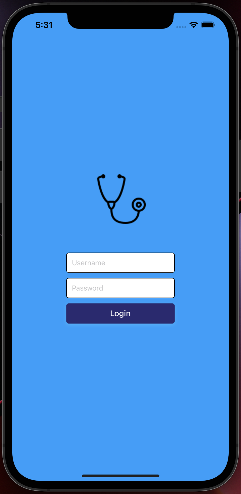
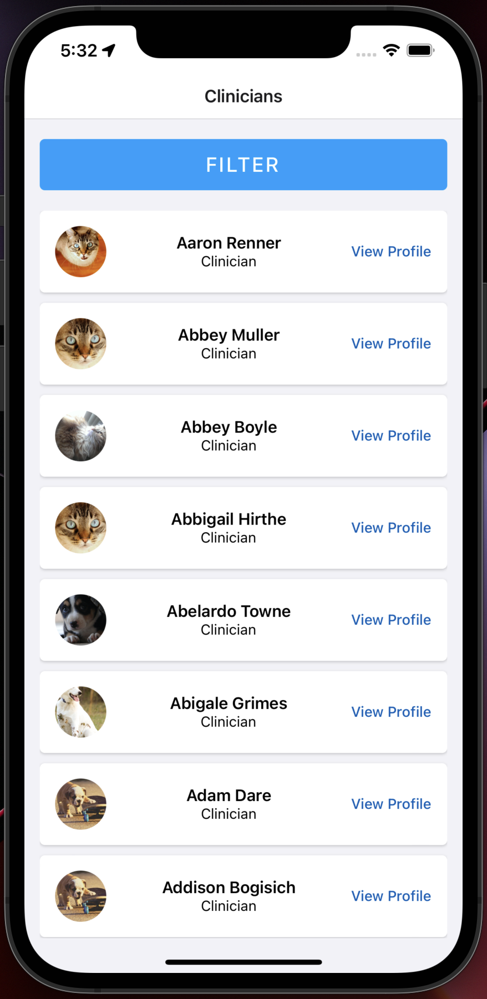
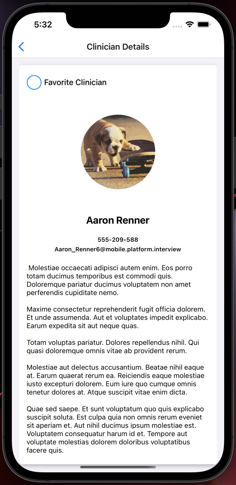
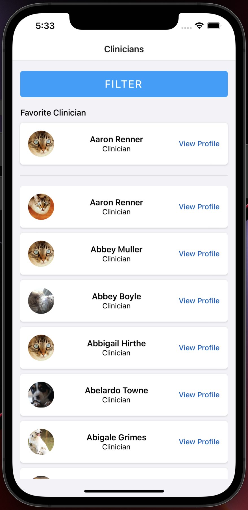

<div id="top"></div>

<!-- PROJECT LOGO -->
<br />
<div align="center">

<h3 align="center">Welcome</h3>

  <p align="center">
    You can access all the repos to the projects that are hosted on YouTube!
    <br />
    <br />
  </p>
<div style="justify-content: space-between;" align="center">
    
    
    

</div>
</div>

<!-- ABOUT THE PROJECT -->
## About The Project
My goal was to build the application using React Natives best practices. I wanted to stick with the most
commonly used libraries, and display my ability to design a React Native application. Redux Toolkit
is beginning to become to go to library for state management, and used redux persist to prevent users from having to
reauthenticate.

### Issues
Attempted to use Google Maps API to find clinicians by state. I was successful.
The problem is the Google API cost. I reached my API limit after 3 refreshes. Although
the real app is on the `master` branch, if you want to run the app using Geocoder, run the command.

### Built With

This section should list any major frameworks/libraries used to bootstrap your project.

* [Async Storage](https://github.com/react-native-async-storage/async-storage)
* [React Native Geolocation](https://github.com/react-native-geolocation/react-native-geolocation)
* [React Navigation](https://reactnavigation.org/)
* [Redux Toolkit](https://redux-toolkit.js.org/)
* [Redux](https://redux.js.org/)
* [Redux Logger](https://www.npmjs.com/package/redux-logger)
* [Redux Persist](https://www.npmjs.com/package/redux-persist)

<p align="right">(<a href="#top">back to top</a>)</p>

```sh
   git checkout geocoder
   ```

<p align="right">(<a href="#top">back to top</a>)</p>


<!-- GETTING STARTED -->
## Getting Started

To get a local copy up and running follow these simple example steps.

### Installation

_Below is an example of how you can instruct your audience on installing and setting up your app. This template doesn't rely on any external dependencies or services._

1. Clone the repo
   ```sh
   git clone git@github.com:Dabrown18/Clinicians_App.git
   ```

2. Authentication
* To authenticate just press the login button. A token will be stored in local storage using `redux-persist`

<p align="right">(<a href="#top">back to top</a>)</p>
